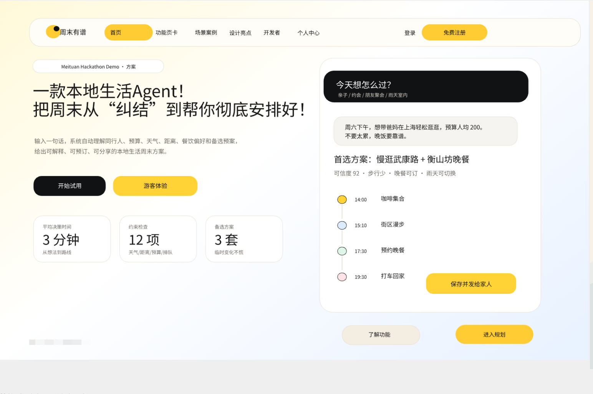
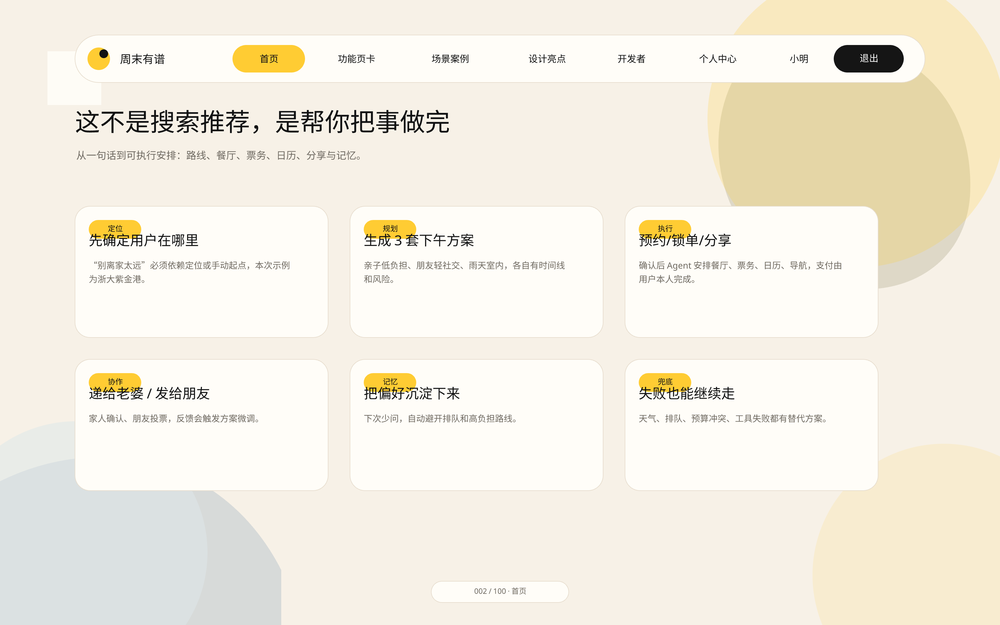
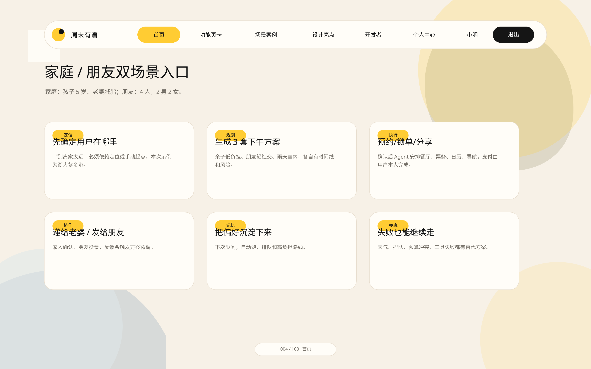
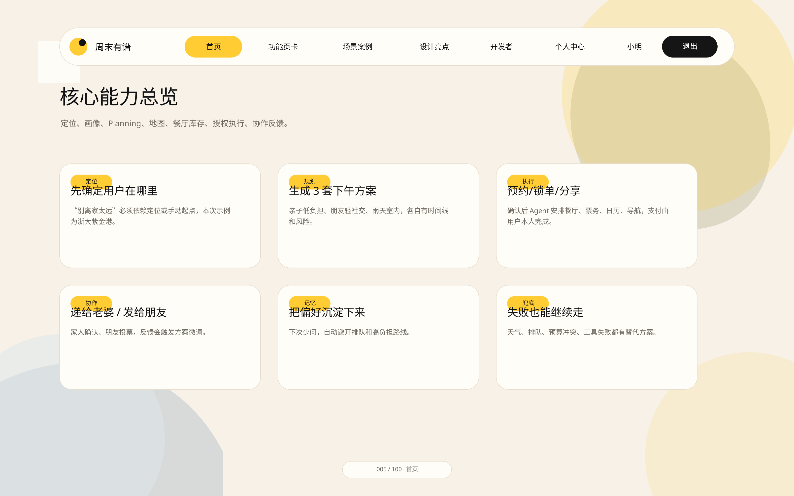
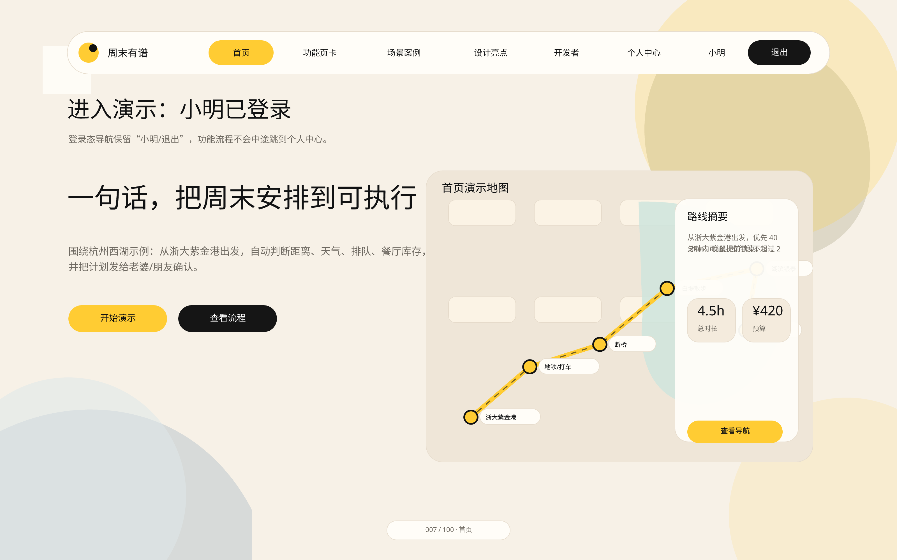
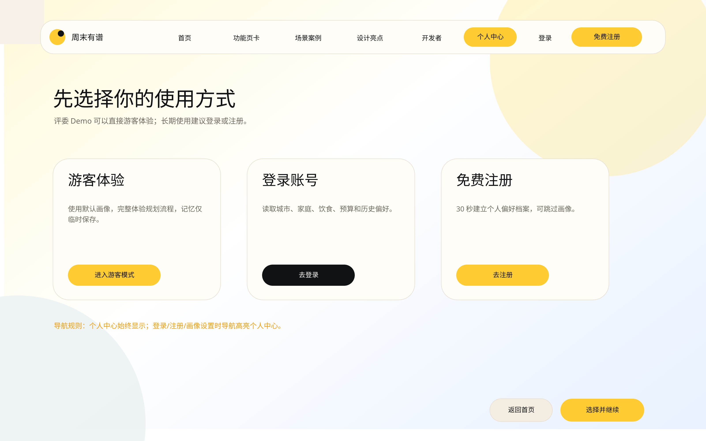

# 🗺️ 周末去哪儿

> **AI 驱动的本地生活周末规划 Agent — 一句话生成可执行的周末计划**




---

## 📖 项目简介

**周末去哪儿** 是一个面向本地生活的周末活动规划 Agent。它不只是给你推荐地点，而是把「想去哪、和谁去、预算多少、天气如何、要不要排队、能不能预订、怎么分享给家人朋友」这些麻烦事串成一条**可执行的计划**。

你只需要输入一句话，它会帮你拆解需求、生成多套方案、处理约束、给出路线、提醒授权边界，并把最终计划变成可以执行和分享的周末安排。

### ✨ 核心亮点

| 能力 | 说明 |
| --- | --- |
| 💬 一句话规划 | 用自然语言描述周末需求，系统自动理解时间、预算、同行人、偏好和限制条件 |
| 📋 多方案对比 | 生成不同风格的活动方案 — 家庭低负担、朋友轻社交、雨天室内备选 |
| 🗺️ 路线与时间线 | 把地点、交通、用餐和活动串成清晰的行程顺序 |
| ✅ 可执行安排 | 支持预约、提醒、分享、投票、反馈修改等完整流程演示 |
| 🧠 记忆沉淀 | 根据反馈沉淀偏好，下次规划时减少重复确认 |
| 🔄 失败兜底 | 天气变化、排队过长、预算冲突或预约失败时，给出替代方案 |
| 🔧 智能工具调用 | 并行调用地图 API 查询 POI、路线、天气，提升规划准确度 |
| ⚡ 自动执行引擎 | 用户授权后自动生成导航、日历提醒、分享链接和预约草稿 |
| 📱 移动端接续 | 桌面端生成方案后，手机扫码继续授权、定位、导航和执行 |
| 🛡️ 城市安全约束 | 所有工具调用和输出都受城市约束，防止混入其他城市信息 |
| 💰 工具预算控制 | Flash/Pro 模式自动控制工具调用次数和延迟，保证响应速度 |
| 📊 完整可观测性 | 记录工具调用、LLM 调用、用户事件和错误日志，便于排查问题 |

---

## 🚀 快速开始

### 环境要求

| 依赖 | 版本 | 说明 |
| --- | --- | --- |
| Node.js | >= 20 | 运行时环境 |
| npm | >= 10 | 包管理器 |
| PostgreSQL | 16 | 可选，Mock 模式不需要 |
| Redis | 7 | 可选，Mock 模式不需要 |

### 方式一：零配置 Mock 模式 ⚡

不需要数据库、Redis 或任何 API Key：

```bash
# 1. 安装依赖
npm install

# 2. 复制环境变量（默认 PLANNING_MODE=mock）
cp .env.example .env

# 3. 启动（两个终端）
npm run dev:api   # 终端 1：后端 :3001
npm run dev       # 终端 2：前端 :5173
```

### 方式二：完整本地部署（含数据库）🐳

```bash
# 1. 启动 PostgreSQL 和 Redis
npm run docker:up

# 2. 数据库初始化
npm run db:generate && npm run db:migrate && npm run db:seed

# 3. 启动服务
npm run dev:api   # 终端 1
npm run dev       # 终端 2
```

> **测试账号**：`xiaoming@example.com` / `weekend123` 或 `admin@planninggo.com` / `admin123`

---

## 📸 功能预览

<details>
<summary><b>👨‍👩‍👧 家庭周末半日游</b> — 点击展开</summary>



亲子友好，轻松半日游。系统自动推荐适合带娃的地点，考虑休息时间、餐饮需求和预算控制。

</details>

<details>
<summary><b>💑 情侣约会</b> — 点击展开</summary>



浪漫约会，电影 + 咖啡 + 晚餐。系统根据偏好推荐氛围餐厅和适合散步的商圈。

</details>

<details>
<summary><b>🎉 朋友聚会</b> — 点击展开</summary>



4 人聚会，娱乐 + 火锅。系统考虑多人偏好平衡，推荐适合聚会的场所和活动时间线。

</details>

<details>
<summary><b>🌧️ 雨天备选方案</b> — 点击展开</summary>



天气突变？系统自动切换室内活动，推荐博物馆、商场、咖啡馆等室内场所。

</details>

<details>
<summary><b>🗺️ 地图路线规划</b> — 点击展开</summary>



可视化展示活动地点、路线规划和交通方式，支持 OpenStreetMap 和高德地图双引擎。

</details>

---

## 🏗️ 技术栈

```
┌─────────────────────────────────────────────────────────────┐
│                        前端 (React + Vite)                   │
│  React 19 · TypeScript · SCSS/CSS Modules · Framer Motion   │
│  Leaflet · Lucide Icons · Zod Validation                     │
├─────────────────────────────────────────────────────────────┤
│                        后端 (Fastify)                        │
│  Fastify 5 · Prisma ORM · PostgreSQL · Redis · JWT Auth     │
├─────────────────────────────────────────────────────────────┤
│                      AI / Agent 层                           │
│  LLM Provider 多路由 (MiMo / Qwen / DeepSeek)               │
│  AMap API · OpenStreetMap · 意图解析 · 工具编排              │
├─────────────────────────────────────────────────────────────┤
│                      部署 & 运维                             │
│  Docker Compose · PM2 · Nginx · Sentry 错误追踪              │
└─────────────────────────────────────────────────────────────┘
```

---

## 📐 架构概览

### Agent 执行流程

```
用户输入 → 意图解析 → 工具编排 → 方案生成 → 授权执行 → 分享协作
   │           │          │          │           │           │
   ▼          ▼          ▼          ▼           ▼           ▼
 "带娃半天   提取时间/   并行查询   多方案      导航/日历    生成分享
  预算300"    预算/偏好   POI/天气   评分排序    分享链接    链接 & 投票
```

### 核心模块

<details>
<summary><b>🔧 工具层 (Tools Layer)</b></summary>

- **工具注册中心**：统一管理所有工具（AMap、内部工具等）
- **工具执行器**：支持并行工具调用，带预算控制和超时管理
- **地图集成**：POI 搜索、路线规划、天气查询、地理编码
- **内部工具**：用户画像、记忆管理、预约查询

</details>

<details>
<summary><b>🛡️ 中间件护栏 (Middleware Guards)</b></summary>

- **城市约束**：确保所有工具调用和输出都在目标城市内
- **工具预算**：Flash/Pro 模式自动控制工具调用次数和延迟
- **输出安全**：检查最终方案是否混入其他城市信息
- **权限控制**：自动执行前检查用户授权范围

</details>

<details>
<summary><b>🤖 Agent Runtime</b></summary>

- **意图解析**：从自然语言中提取时间、预算、同行人、偏好
- **上下文构建**：聚合用户画像、环境数据和安全策略
- **工具编排**：并行调用工具生成候选 POI 池
- **方案生成**：基于候选池生成多个可执行方案

</details>

<details>
<summary><b>⚡ 自动执行引擎 (Execution Engine)</b></summary>

- **状态机**：`proposed → prepared → waiting_authorization → authorized → executing → succeeded/failed`
- **幂等性**：每个动作都有 idempotencyKey，防止重复执行
- **执行提供者**：导航、日历、分享、预约等外部服务集成

</details>

<details>
<summary><b>📱 移动端接续 (Mobile Handoff)</b></summary>

- **QR 码生成**：桌面端生成方案后显示二维码
- **接续令牌**：安全的令牌机制，5 分钟有效期
- **会话同步**：桌面端和手机端共享同一方案和执行状态

</details>

<details>
<summary><b>📊 可观测性 (Observability)</b></summary>

- **工具调用日志**：记录所有工具调用的输入、输出、延迟
- **LLM 调用日志**：记录 LLM 调用的 token 使用、延迟、状态
- **用户事件日志**：记录用户行为和页面访问
- **错误日志**：记录客户端和服务器端错误

</details>

---

## 🎮 演示模式

周末去哪儿 支持演示模式，方便在比赛、演示或测试场景中快速展示核心功能。

### 启用演示模式

```bash
export DEMO_MODE=true
export PLANNING_MODE=mock
```

### 演示场景

| 场景 | 说明 | 示例 Prompt |
| --- | --- | --- |
| 👨‍👩‍👧 家庭周末半日游 | 亲子友好，轻松半日游 | "这周六带老婆和 6 岁儿子在杭州周边玩半天..." |
| 💑 情侣约会 | 浪漫约会，电影 + 咖啡 + 晚餐 | "这周日和女朋友在杭州约会一天，想要浪漫一点..." |
| 🎉 朋友聚会 | 4 人聚会，娱乐 + 火锅 | "这周六和三个朋友在杭州聚会，想要有趣的活动..." |

### 预约失败模拟

```bash
# 模拟餐厅/活动无座位
export MOCK_BOOKING_FAILURES=no_seat

# 模拟景点门票售罄
export MOCK_BOOKING_FAILURES=no_ticket

# 模拟时间冲突
export MOCK_BOOKING_FAILURES=time_conflict
```

### 完整演示启动

```bash
# 终端 1：启动后端
DEMO_MODE=true PLANNING_MODE=mock MOCK_BOOKING_FAILURES=no_seat npm run dev:api

# 终端 2：启动前端
npm run dev

# 浏览器访问 http://localhost:5173
```

详细演示脚本请参考 [DEMO_SCRIPT.md](./DEMO_SCRIPT.md)。

---

## 🔌 API 接口

### 健康检查

| 端点 | 方法 | 说明 |
| --- | --- | --- |
| `/api/health` | GET | 存活探针 (liveness probe) |
| `/api/ready` | GET | 就绪探针 (readiness probe) |

<details>
<summary><b>/api/ready 返回示例</b></summary>

```json
{
  "ok": true,
  "db": "ok",
  "redis": "ok",
  "llm": {
    "configured": true,
    "provider": "mimo",
    "model": "mimo-v2.5-pro",
    "mode": "llm"
  },
  "amap": { "configured": true },
  "mockAllowed": false,
  "uptime": 12345
}
```

</details>

### 认证

| 端点 | 方法 | 说明 |
| --- | --- | --- |
| `/api/auth/login` | POST | 邮箱登录 |
| `/api/auth/guest` | POST | 游客访问 |
| `/api/auth/forgot-password` | POST | 请求密码重置 |
| `/api/auth/reset-password` | POST | 使用重置令牌设置新密码 |

### Agent

| 端点 | 方法 | 说明 |
| --- | --- | --- |
| `/api/agent/plan` | POST | 生成规划方案 |
| `/api/agent/chat` | POST | 对话交互 |

### 服务入口

| 端点 | 方法 | 说明 |
| --- | --- | --- |
| `/api/service-actions/prepare` | POST | 准备服务入口，生成 deep link 或 copy text |
| `/api/actions/track` | POST | 埋点追踪用户点击行为 |

---

## 🐳 部署指南

### Docker Compose（推荐）

```bash
# 1. 创建环境变量（JWT/COOKIE 密钥自动生成）
JWT_ACCESS_SECRET=$(openssl rand -hex 32)
JWT_REFRESH_SECRET=$(openssl rand -hex 32)
COOKIE_SECRET=$(openssl rand -hex 32)
cat > .env <<EOF
POSTGRES_PASSWORD=your-strong-db-password
REDIS_PASSWORD=your-strong-redis-password
JWT_ACCESS_SECRET=$JWT_ACCESS_SECRET
JWT_REFRESH_SECRET=$JWT_REFRESH_SECRET
COOKIE_SECRET=$COOKIE_SECRET
AMAP_WEB_SERVICE_KEY=your-amap-key
QWEN_API_KEY=your-qwen-key
CORS_ORIGINS=https://example.com
EOF

# 2. 启动
docker compose -f docker-compose.prod.yml up -d

# 3. 检查健康状态
curl http://localhost:3001/api/ready

# 4. 更新部署
docker compose -f docker-compose.prod.yml up -d --build
```

### PM2 + Nginx

<details>
<summary><b>PM2 启动命令</b></summary>

```bash
npm install -g pm2
pm2 start dist/server/index.js --name planninggo-api --env production
pm2 logs planninggo-api
pm2 startup
pm2 save
```

</details>

<details>
<summary><b>Nginx 配置片段</b></summary>

```nginx
server {
    listen 443 ssl http2;
    server_name example.com;

    ssl_certificate     /etc/letsencrypt/live/example.com/fullchain.pem;
    ssl_certificate_key /etc/letsencrypt/live/example.com/privkey.pem;

    # 前端静态文件
    root /path/to/planninggo/dist;
    index index.html;

    location /assets/ {
        expires 1y;
        add_header Cache-Control "public, immutable";
    }

    # API 反代
    location /api/ {
        proxy_pass http://127.0.0.1:3001;
        proxy_set_header Host $host;
        proxy_set_header X-Real-IP $remote_addr;
        proxy_read_timeout 60s;
    }

    # SPA fallback
    location / {
        try_files $uri $uri/ /index.html;
    }
}
```

</details>

---

## 🔒 生产安全校验

启动时会自动校验以下规则，不满足则启动失败：

| 条件 | 要求 |
| --- | --- |
| `NODE_ENV=production` | `JWT_ACCESS_SECRET` 必须 ≥32 位且非默认值 |
| `NODE_ENV=production` | `JWT_REFRESH_SECRET` 必须 ≥32 位且非默认值 |
| `NODE_ENV=production` | `COOKIE_SECRET` 必须 ≥32 位 |
| `NODE_ENV=production` | `DATABASE_URL` 不能是默认本地地址 |
| `NODE_ENV=production` | `REDIS_URL` 不能是 localhost |
| `PLANNING_MODE=llm` | 必须至少配置一个 LLM API Key |
| `PLANNING_MODE=mock` + production | 需设置 `ALLOW_MOCK_PROVIDER_IN_PRODUCTION=true` |

---

## 🧪 测试

```bash
# 运行所有测试
npm test

# E2E 测试
npm run test:e2e

# 冒烟测试
npm run smoke:all
```

---

## 📁 项目结构

```
周末去哪儿/
├── src/
│   ├── components/        # React 组件
│   │   ├── RealMap/       # 地图组件（OSM + AMap）
│   │   ├── MapSelector/   # 地图切换器
│   │   └── ...
│   ├── pages/             # 页面组件
│   │   ├── HomePage/
│   │   ├── FeaturesPage/
│   │   └── ...
│   ├── server/            # Fastify 后端
│   │   ├── modules/       # 业务模块
│   │   ├── plugins/       # Fastify 插件
│   │   └── routes/        # API 路由
│   └── lib/               # 工具库
├── prisma/                # 数据库 Schema & 迁移
├── public/                # 静态资源
├── docker-compose.prod.yml
└── DESIGN.md              # 设计系统规范
```

---

## 🤝 贡献

欢迎提交 Issue 和 Pull Request！

---

## 📄 License

本项目基于仓库内 [License](./License) 文件授权使用。

---

**Made with ❤️ for better weekends**

`本地生活` `周末规划` `AI Agent` `行程安排` `多人协作` `路线规划` `预约执行` `家庭出行` `朋友聚会` `雨天备选`
