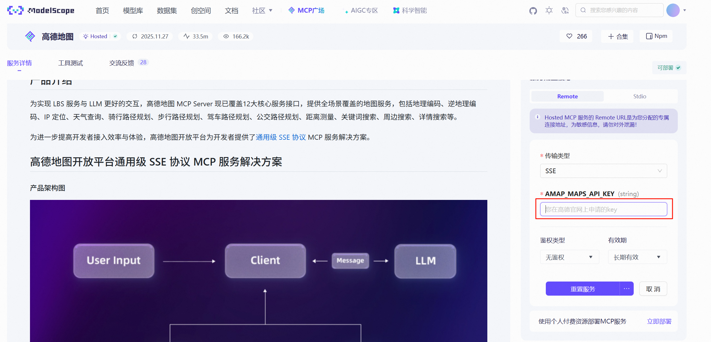

# Travel Agent Demo (LangChain 1.0 + MCP + Qwen)

一个基于 **LangChain 1.0**、**阿里通义 Qwen** 和 **MCP(amap-maps)** 的旅游规划 Agent Demo，支持：

- 并行调用高德地图相关工具（搜索 POI、路线规划、天气查询）
- 中间件级别的城市约束、工具预算控制、输出城市安全检查
- **🆕 AI 深度思考过程展示**（通过 `enable_thinking=True` 启用 Qwen 推理）
- Gradio 前端，支持流式对话与调试日志查看（开发者模式）
- **🆕 Claude Skills 集成**（项目架构分析和功能开发支持）

## 功能特性

- ✅ 使用 `langchain-mcp-adapters` 连接自建 MCP Server（高德地图）
- ✅ 自动提取用户输入中的城市，并约束所有工具调用 city/adcode
- ✅ 工具调用轮次预算控制，防止无限工具循环
- ✅ 响应后检查输出是否出现"未指定城市"，自动提示修正
- ✅ **🆕 AI 思考过程完整展示**（可选展开面板查看）
  - 意图理解：如何分析用户需求
  - 策略规划：决定调用哪些工具及顺序
  - 信息整合：如何组织最终回复
- ✅ Gradio 前端支持：
  - 聊天窗口
  - 摘要日志（工具调用、模型调用、城市解析）
  - **🆕 AI 思考过程面板**（独立展示 reasoning）
  - 原始事件 JSON（开发者模式）

## 安装

```bash
git clone https://github.com/<yourname>/travel-agent.git
cd travel-agent

# 建议使用虚拟环境（略）

pip install -r requirements.txt
```

## 环境配置（Qwen Key 与高德 MCP）

本项目通过以下两个环境变量进行配置（可参考仓库中的 `.env.example`）：

- `DASHSCOPE_API_KEY`：
  - 用于访问 **通义千问 Qwen 模型**（通过 DashScope 平台）
  - 获取方式：登录阿里云通义千问 / DashScope 控制台，创建 API Key，将值填入 `.env` 中的 `DASHSCOPE_API_KEY`
  - 推荐模型：`qwen-turbo-latest`（默认）、或按需改为 `qwen-plus`

- `AMAP_MCP_URL`：
  - 用于连接 **高德地图 MCP Server（amap-maps）** 的 SSE 服务地址
  - 获取方式（示例流程）：
    1. 打开 ModelScope（魔搭社区），进入 **MCP 广场**
    2. 搜索「高德」或「amap」相关 MCP，按照页面说明填写对应的高德api，获取url

      

    3. 在文档中找到提供的 **SSE 访问地址**（通常是以 `http://.../sse` 或 `https://.../sse` 结尾的 URL）
    4. 将该地址填入 `.env` 中的 `AMAP_MCP_URL`

配置完成后，确保本地 `.env` 文件与上述环境变量一致，再运行：

```bash
python main.py
```

## 🆕 新增功能说明

### AI 深度思考过程展示

从本版本开始，系统支持展示 AI 的完整推理过程：

#### 工作原理

1. **启用思考模式**：在 `agent.py` 中配置 `enable_thinking=True`
2. **收集推理链**：`ui.py` 中的 `stream_answer()` 函数从 `AIMessage.additional_kwargs['reasoning_content']` 逐块累积推理内容
3. **前端展示**：Gradio UI 中新增 **"💭 AI 思考过程"** 可折叠面板，用户可选择查看

#### 使用场景

- **用户透明度**：让用户了解 AI 的决策逻辑
- **信任建立**：完整的推理过程增强用户信任度
- **调试优化**：开发者可通过 reasoning 识别 AI 的决策偏差
- **教育价值**：用户可学习系统性的规划思路

#### 界面效果

在 Gradio 主界面中，点击 **"💭 AI 思考过程"** 可展开查看完整的推理链：

```
用户问"规划成都2天美食路线"，我需要明确理解需求：
- 目标城市：成都
- 时间限制：2天
- 兴趣点：美食

决定调用以下工具获取信息：
1. searchPOI（获取美食地点）
2. getRoute（规划最优路线）
3. getWeather（查询天气）

基于这些信息，我将生成最终答案...
```

### Claude Skills 集成

项目包含两个 Claude Skills（位于 `.claude/skills/`）：

#### 1. **understand** Skill
- **功能**：深度分析项目架构、Agent 配置及 MCP 集成
- **输出**：生成 `docs/ARCHITECTURE.md` 中文架构文档
- **使用**：在 Claude Code 中运行 `/understand`
- **文件路径**：`.claude/skills/understand/SKILL.md`

#### 2. **feature** Skill
- **功能**：基于架构规范安全地实现新功能或优化现有代码
- **使用**：在 Claude Code 中运行 `/feature`
- **文件路径**：`.claude/skills/feature/SKILL.md`

这些 Skills 可帮助开发者快速理解项目结构，并以最佳实践方式进行开发。

## 项目结构

```
├── main.py                      # 应用启动入口
├── config.py                    # 配置管理与常量定义
├── agent.py                     # Agent 创建与配置
├── tools.py                     # MCP 工具加载与异步包装
├── middleware.py                # LangChain 中间件集合
├── ui.py                        # Gradio Web UI 实现（新增 reasoning 支持）
├── requirements.txt             # 依赖清单
├── .env                         # 环境变量配置（未提交）
├── .env.example                 # 环境变量模板
├── readme.md                    # 本文件
├── docs/
│   └── ARCHITECTURE.md          # 详细架构文档
├── .claude/
│   └── skills/                  # Claude Skills 集合
│       ├── understand/          # 架构分析 Skill
│       └── feature/             # 功能开发 Skill
└── src/
    └── amap-mcp-config.png      # 配置说明图
```

## 技术栈版本

| 组件 | 版本 | 说明 |
|-----|------|------|
| LangChain | >=1.0.0 | Agent 框架核心 |
| langchain-community | >=0.3.0 | 通义千问模型集成 |
| langchain-mcp-adapters | >=0.0.8 | MCP 协议适配器 |
| dashscope | >=1.14.0 | 阿里云通义千问 SDK |
| Gradio | >=4.1.0 | Web UI 框架 |

## 贡献指南

如需改进该项目，建议：

1. 运行 `/understand` Skill 了解项目架构
2. 参考 `docs/ARCHITECTURE.md` 中的设计模式
3. 使用 `/feature` Skill 实现新功能
4. 提交 PR 前运行测试验证

## 相关文档

- **完整架构文档**：查看 `docs/ARCHITECTURE.md`（包含系统设计、中间件详解、优化方向等）
- **Claude Skills**：见 `.claude/skills/` 目录说明

## 许可证

MIT License
